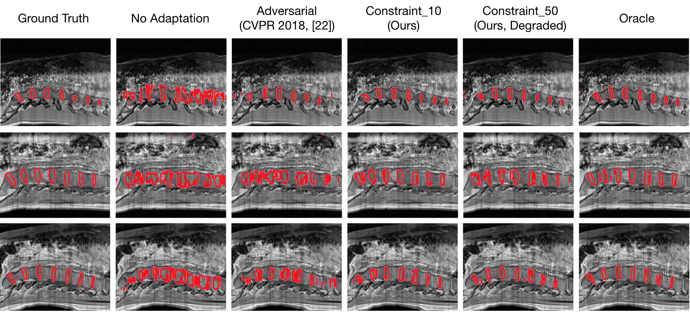

# Constrained Domain Adaptation
Constrained domain adaptation for segmentation.
Pytorch implementation of our method for adapting Semantic Segmentation using constrained optimization. We compare to adversarial adaptation, using the method proposed here : https://github.com/wasidennis/AdaptSegNet.

## Example Results



# Installation
Install PyTorch from http://pytorch.org with Python 2 and CUDA 8.0

# Dataset
The dataset is available at https://ivdm3seg.weebly.com/data.html. We used the Water (Wat) modality as the Source domain, and the In-Phase (IP) modality as the Target domain. Note: in our experiments we rotated the data from the sagittal plane to the transverse plane.

Download the data and put in the `data/sagittal` folder, then rotate and save into the `data/transverse` folder, both for the Wat and the IP modality:

```
python rotate.py  --base_folder='./data/transverse/IP/' --folders=['train','val'] --save_folder='./data/sagittal/IP/' --rot=’rot’  --grp_regex="Subj_\\d+_"
```

# Testing

Train the model with constrained domain adaptation. Create the Results folder `results/IP`. Results will be saved in the result folder `results/IP/Constraint/`
```
python main.py --dataset='data/transverse/' --target_dataset='data/transverse/' 
                         --folders="[('Wat', png_transform, False), ('GT', gt_transform, False)]"
                         --target_folders="[('IP', png_transform, False), ('GT', gt_transform, False)]+"
                                        "[('GT', gt_transform, False), ('GT', gt_transform, False)]"
                         --grp_regex='Subj_\\d+_\\d+'
                         --losses="[('CrossEntropy', {'idc': [0,1], 'weights':[1,1]}, None, None, None, 0),"
                                " ('NaivePenalty', {'idc': [1]},'PreciseBounds', {'margin': 0.1, 'mode': 'percentage'}, 'soft_size', 2.5)]"
                         --losses_source="[('CrossEntropy',{'idc': [0,1],'weights':[1,1]},None,None,None, 1)]"
                          --model_weights='pretrained_source.pkl' --n_class=2 --in_memory=False, 
                          --network='ENet' --resize=36 --scheduler='DummyScheduler' 
                         scheduler_params='{}', workdir='results/Constraint'
```
